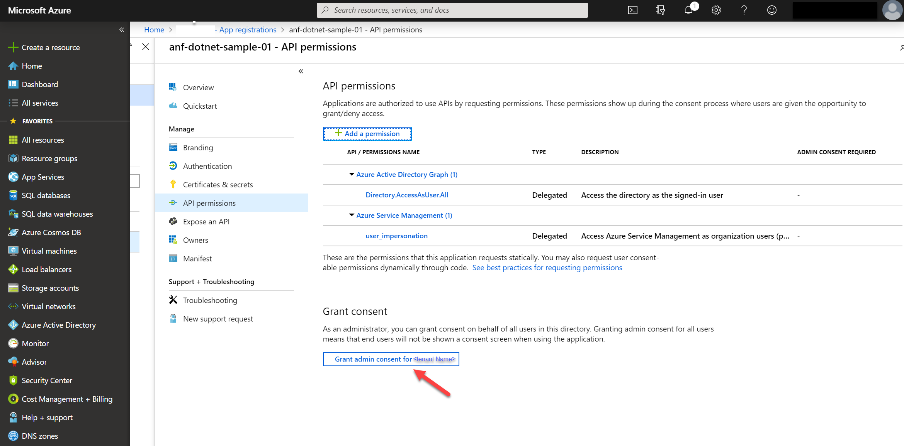

# AzureNetApFilesSDKSamples
Repository that includes ANF's SDK code usage samples.

# Prerequisites

1. For this sample console app work, we need initially configure an application in Azure Active Directory
    1. Create a new application within your Azure Active Directory Tenant:
        ```bash
        az ad app create --display-name anf-sdk-samples --native-app --reply-url http://localhost --required-resource-accesses @manifest.json

        ```

        **manifest.json contents**
        ```json
        [{
            "resourceAppId": "797f4846-ba00-4fd7-ba43-dac1f8f63013",
            "resourceAccess": [
                {
                    "id": "41094075-9dad-400e-a0bd-54e686782033",
                    "type": "Scope"
                }
            ]
        }]
        ```
    2. Take a note of the ApplicationID value and change the value on `clientID' setting at anf-dotnet-sample\appsettings.json configuration file
    3. If the user signing-in does not have permissions to consent to these permissions described within the manifest.json file, you should ask your Azure Active Directory Global Admin to apply these permissions for you before executing the console application.
       
        To pre-approve these assigments:
        1. Within Azure Active Directory, click "App registrations"
        2. Start typing the application name in the search field until you see the application name in the list
        3. Click the application name and select "Api permissions"
        3. The list of required api permissions will be shown and to grant consent, just click the "Grant admin consent for `<Azure AD Name>`" button.
            

 
